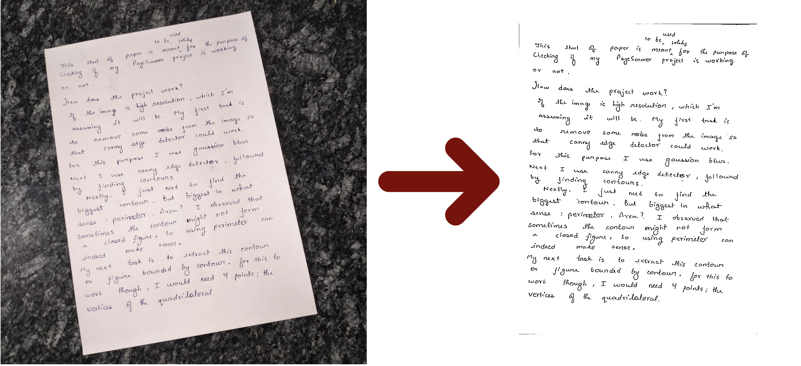

# Page Scanner
Page Scanner is a tool that crops out relevant image of a page from the entire image and then converts it to black and white.

For more details, read my [article](https://medium.com/@cmaspi/document-scanner-using-opencv-a43b96a35f82) on towardsdatascience